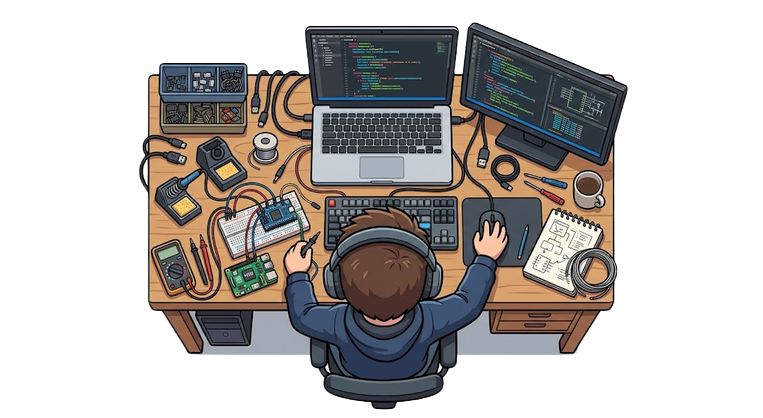

# Satrio Utomo 

###  Firmware Engineer | Embedded Systems | Software Engineer

`turning software into systems that interact with the real world.`

  
  

 

 

### Firmware in code. Hardware in action.

<table>
  <tr>
    <td align="center">
      
    </td>
    <td align="center">
      
    </td>
  </tr>
  <tr>
    <td align="center">
      
    </td>
    <td align="center">
      
    </td>
  </tr>
  <tr>
    <td align="center">
      
    </td>
    <td align="center">
      
    </td>
  </tr>
</table>

 

  

<a> 
    
  
   
</a>
